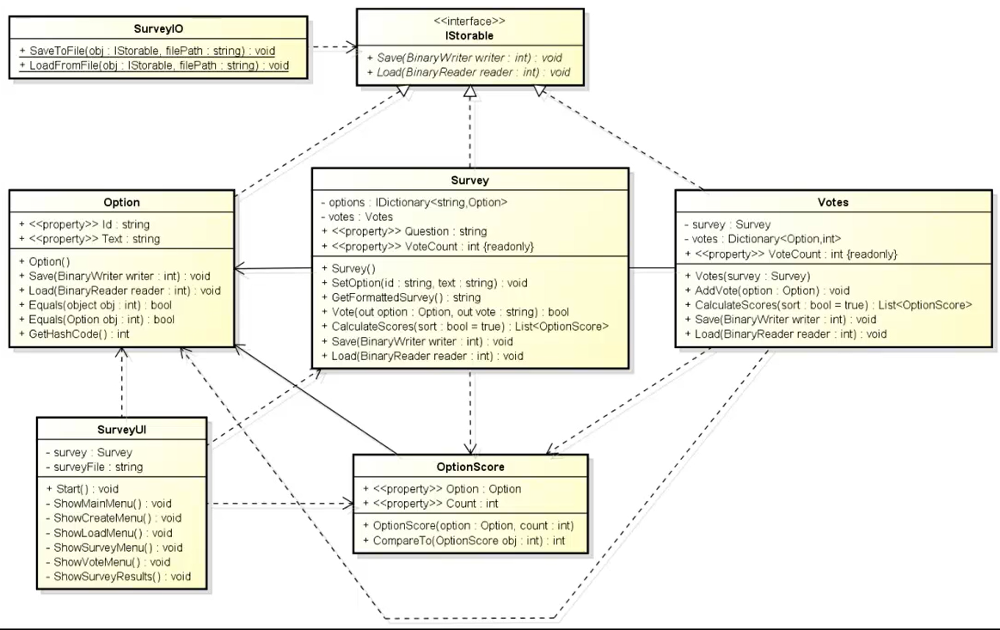

# Poll Manager CLI(Command Line Interface)  - Instructions
Resume: A simple Poll Manager for your votations, is open for you create your questions and manager all response from votations.

# ***The Design of project in UML***

# What is the objective of this project ?

# How I can use this ?

# Too have a tutorial video in Português from Brazil, but too have legends.
